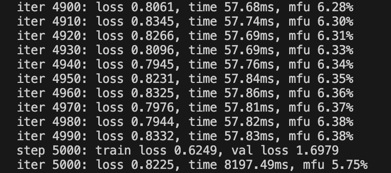
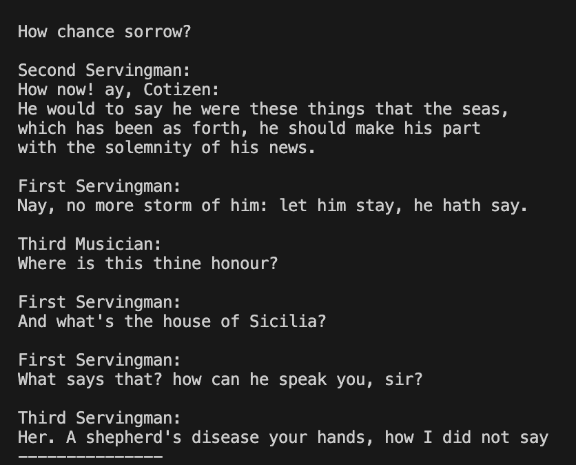

# 计算语言学大作业

> 庾源清 王哲凡

## 实验环境搭建

在nanoGPT代码基础上，运行命令
```
python train.py config/train_shakespeare_char.py
```
最后10个step的截图如下：



运行命令
```
python sample.py --out_dir=out-shakespeare-char
```
生成样本截图如下：
