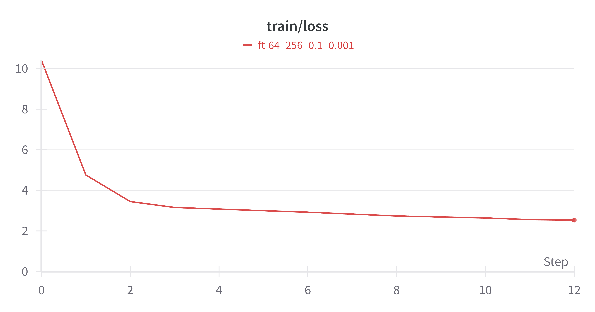
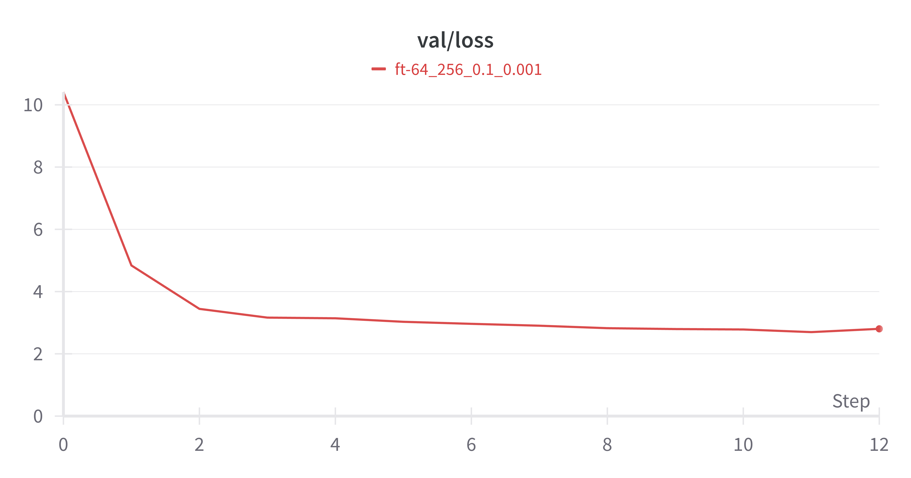
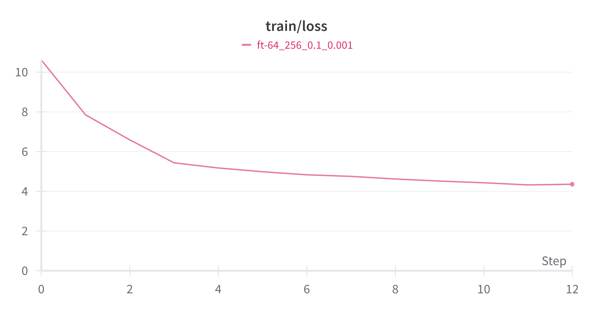
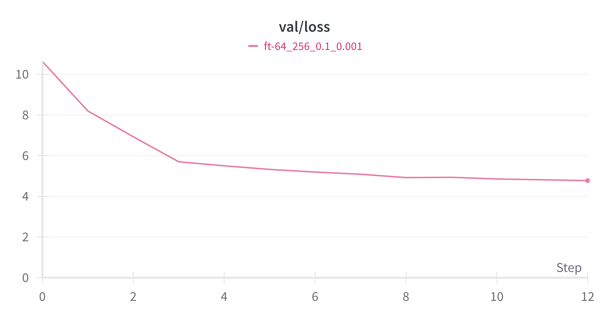
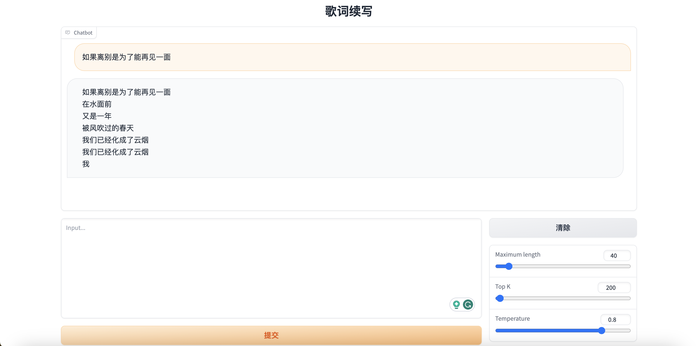

# 计算语言学大作业-实验报告

> 庾源清 2023310756 王哲凡 20233107xx

## 0. 实验环境搭建

在nanoGPT代码基础上，运行命令

```shell
python train.py config/train_shakespeare_char.py
```

最后 $10$ 个 step 的截图如下：


运行命令

```shell
python sample.py --out_dir=out-shakespeare-char
```

生成样本截图如下：


## 1. 预训练
### 1.1. 字符级别模型预训练
#### 1.1.1. 数据处理
仿照 `nanoGPT` ⾥ `shakespeare_char` 对于歌词语料进行预处理，对字符进行编码。其中，训练集、验证集和测试集的划分采用原始数据中的划分方式，在全部数据上建立词表，对于训练集、验证集和测试集进行编码。数据的基本信息如下：

**词表大小**：$7,409$
|          | token数 |
| :------: | :-----: |
| 训练集   |  $34,637,186$ |
| 验证集   |  $864,927$ |
| 测试集   |  $1,731,006$ |
| 全部数据 |  $37,233,119$ |


#### 1.1.2. 模型训练
仿照 `nanoGPT` ⾥ `shakespeare_char`，设置训练参数`config/train_lyrics_char.py` (选择最小规模的参数构建babyGPT)

运行命令

```shell
python train.py config/train_lyrics_char.py
```

训练 $5000$ 轮后，`train/loss = 2.6334`，`val/loss = 2.6664`

Train Loss 曲线和 Validation Loss 曲线如下:


编写代码测试测试集上的 [PPL](https://huggingface.co/docs/transformers/perplexity)，设置 `stride = 64`,运行命令

```shell
python evaluate.py config/eval_lyrics_char.py
```

得到结果

```
PPL = 8.036737442016602
```

#### 1.1.3. 歌词续写

设置 `tempreture = 0.8`，以“如果离别是为了能再见一面”为第一句续写歌词，结果如下:
```
如果离别是为了能再见一面
我也不会再思念
就算在每一天
我也都会想起你一直陪着你
我不会再怀念
就算在每一天
我也都会想起你一直陪着你
我不会再怀念
...
就算在每一天
我也都会想起你一直陪着你
我不会再怀念
就算在每一天
我也都会想起你一直陪
```
有如下观察：
1. 模型具有一定的续写能力。观察前几句的生成，逻辑上和句法上没太大问题，句尾还有“押韵”现象。
2. 模型在生成长文本时出现问题。观察后续歌词的生成，发现出现几句歌词一直循环的现象。这个现象在多次实验中均有出现，推测原因在于训练语料不够多，训练不够充分，且模型对于前面的生成的 token 依赖性太强。


### 1.2. 分词后语⾔模型预训练

#### 1.2.1. 数据处理
使用词表大小为 $30000$ 的 Unigram 算法进行分词。其中，训练集、验证集和测试集的划分采用原始数据中的划分方式，在全部数据上建立词表，对于训练集、验证集和测试集进行编码。数据的基本信息如下：

**词表大小**：$30000$
|          | token数 |
| :------: | :-----: |
| 训练集   |    $18,488,903$     |
| 验证集   |    $439,310$     |
| 测试集   |    $877,700$     |
| 全部数据 |    $19,805,913$     |


#### 1.2.2. 模型训练
设置训练参数 `config/train_lyrics.py`

运行命令

```shell
python train.py config/train_lyrics.py
```

训练 $5000$ 轮后，`train/loss = 4.30251`，`val/loss = 4.67227`

Train Loss 曲线和 Validation Loss 曲线如下:


编写代码测试测试集上的 [PPL](https://huggingface.co/docs/transformers/perplexity)，设置 `stride = 64`,运行命令

```shell
python evaluate.py config/eval_lyrics.py
```

得到结果

```
PPL = 58.53092575073242
```


#### 1.2.3. 歌词续写

设置 `tempreture = 0.8`，以“如果离别是为了能再见一面”为第一句续写歌词，结果如下:
```
如果离别是为了能再见一面
今生的爱情故事为何错过
回忆从心会碎
曾经那么的甜蜜
在回忆中永远没开始
那是一种美丽的承诺
还是无法改变的幸福
...
在回忆中永远没开始
那些年
一个背影
在记忆中
再起 再起
在记忆中
让每个清晨
都写在彼此的记忆
都曾偶尔相遇
从时间开始
那是一种美丽的承诺
...
```

有如下观察：
1. 模型具有一定的续写能力，逻辑上和句法上没太大问题。
2. 模型在生成长文本时表现比字符级别模型更好。虽然也出现了一定程度上的歌词重复，但中间存在一些歌词跳出原有的重复循环，重复率比字符级别模型低很多。


#### 1.2.4. 初始 loss 与词表大小关系

与字符级别模型相比，分词后语言模型的初始 loss 更高。

原因解释：假设词表大小为 $V$，在第一个step中模型通常会给予词表中每个单词近似相等的预测概率 $\frac{1}{V}$。在交叉熵损失函数中，对于单个实例:
$$\mathcal{L}_i = -\sum_{i=1}^Vy_i \log(p_i) = -\log\left(\frac{1}{V}\right)=\log(V)$$

在全部序列上，整体平均 loss 也是 $\log(V)$

对于字符级别模型，词表大小为 $7409$，初始loss约为 $\log(V)\approx8.91$

对于分词后模型，词表大小为 $30000$，初始loss约为 $\log(V)\approx10.31$

估算结果与实验日志一致。


### 1.3. 调参

保持模型架构不变(babyGPT)，首先考虑调整 `block_size` 和 `batch_size` 这两个参数。考虑到显存限制，`block_size` 取  $[128,256,512]$，`batch_size` 取 $[32,64,128]$，主要参数组合及对应效果如下所示：

| `block_size` | `batch_size` | `train/loss` | `val/loss`  | PPL       |
| :--------: | :--------: | :--------: | :-------: | :-------: |
| $128$        | $64$         | $5.143$      | $5.473$     | $97.54$     |
| $128$        | $128$        | $4.715$      | $5.128$     | $70.67$     |
| $256$        | $64$         | $4.303$      | $4.672$     | $58.53$     |
| $256$        | $128$        | $3.957$      | $4.421$     | $\pmb{46.92}$ |
| $512$        | $32$         | $4.143$      | $4.477$     | $66.11$     |
| $512$        | $64$         | $\pmb{3.736}$  | $\pmb{4.145}$ | $47.57$     |


有如下观察：

1. 在当前显存限制下，`block_size` 和 `batch_size` 越大，loss 越低，PPL 在 `block_size = 256`，`batch_size = 128` 时达到最优。具体而言，在 `block_size` 不变时，`batch_size` 越大，loss 和 PPL 越低；`block_size` 不变时，`batch_size` 越大，loss 越低和 PPL 越低。且 `block_size` 对结果的影响更大。
2. 存在轻微的过拟合现象。例如对于 $(512,64)$ 的参数选择，loss 最低，但测试集上PPL不是最优。


此外，我们还对于不同的 `drop_out`和 `learning_rate` 进行了适当测试，固定 `block_size = 512`，`batch_size = 64`，结果如下表所示：

| `drop_out` | `learning_rate` | `train/loss` | `val/loss` | PPL       |
| :------: | :-----------: | :--------: | :------: | :-------: |
| $0.3$      | $10^{-3}$          | $3.991$      | $4.351$    | $58.71$     |
| $0.2$      | $10^{-3}$          | $3.736$      | $4.145$    | $47.57$     |
| $0.1$      | $10^{-3}$          | $\pmb{3.589}$  | $\pmb{4.051}$ | $\pmb{43.53}$ |
| $0.1$      | $10^{-2}$          | $8.300$      | $8.628$    | $5005.71$   |
| $0.1$      | $10^{-4}$          | $5.201$      | $5.516$    | $205.30$    |


有如下观察：

1. 由训练 loss 曲线可以看到，`learning_rate` 过小($10^{-4}$)会导致收敛很慢，而 `learning_rate` 过大($10^{-2}$)导致没有收敛。
2. 模型在 `drop_out = 0.1` 时取得最好效果。

## 2. 微调
### 2.1. 直接微调
#### 2.1.1. 数据处理
仿照 `nanoGPT` ⾥ `shakespeare_char` 对于歌词语料进行预处理，对字符进行编码。其中，训练集、验证集和测试集的划分采用原始数据中的划分方式。

使用 `uer/gpt2-large-chinese-cluecorpussmall` 的 Tokenizer 对语料进行 Tokenize。最终得到的新数据集命名为 `lyrics_ft`。

#### 2.1.2. 模型训练
设置训练参数 `config/train_lyrics.py`

运行命令

```shell
python train.py config/finetune_lyrics_char_large.py
```

训练 $3000$ 轮后，`train/loss = 2.53503`，`val/loss = 2.80347`

Train Loss 曲线和 Validation Loss 曲线如下:






编写代码测试测试集上的 [PPL](https://huggingface.co/docs/transformers/perplexity)，设置 `stride = 64`,运行命令

```shell
python evaluate.py config/eval_lyrics.py
```

得到结果

```
PPL = 8.902772903442383
```

#### 2.1.3. 歌词续写

设置 `tempreture = 0.8`，以“如果离别是为了能再见一面”为第一句续写歌词，结果如下:
```
如果离别是为了能再见一面 是不是会有一天
我不会再哭泣
只想你还会去哪里
我的爱像是风筝
断了线的爱
能不能再爱一遍
心都碎了花心就碎了
爱变成伤痕累累
如果离别是为了能再见一面酚是不是会有一天我不会再哭泣只想你还会去哪里我的爱像是风筝断了线的爱能不能再爱一遍心都碎了花心就碎了爱变成伤痕累累
如果离别是为了能再见一面wn是不是会有一天我不会再哭泣只想你还会去哪里我的爱像是风筝断了线的爱能不能再爱一遍心都碎了花心就碎了爱变成伤痕累累
...
```
有如下观察：
1. 模型具有一定的续写能力。观察前几句的生成，逻辑上和句法上没太大问题，除了`心都碎了花心就碎了`这句意义不明。
2. 由于使用的预训练模型的 Tokenizer 不存在 `\n` 这种字符，所以生成的文本完全连接没有区分开，我们手动将第一段尝试手动区分以增强可读性。
3. 模型在生成长文本时出现问题。观察后续歌词的生成，发现出现基本在第一段基础上保持循环的现象。推测预训练模型对于前面的生成的 token 依赖性比较强。
4. 在后续几遍的重复中，出现了一些不合理的词汇，如 `酚`、`wn` 等，进一步说明了模型的长文本能力欠缺。

### 2.2. 词表扩展后微调
#### 2.2.1. 词表扩展处理
使用 1.2.1. 处理好的 `lyrics` 数据集，对于其 vocabulary 中的每个词，使用 `uer/gpt2-large-chinese-cluecorpussmall` 的 Tokenizer 对其编码。根据编码结果获得的编码序列，将对应的 `uer/gpt2-large-chinese-cluecorpussmall` 的 `Embedding` 结果取得平均，作为 vocabulary 中每个词的预训练 `Embedding`。

对于 `lm_head` 与 `Embedding` 处理相同（实际上两者对应同一个向量）。

#### 2.1.2. 模型训练
设置训练参数 `config/finetune_lyrics_large.py`

运行命令

```shell
python train.py config/finetune_lyrics_large.py
```

训练 $3000$ 轮后，`train/loss = 4.35665`，`val/loss = 4.77131`

Train Loss 曲线和 Validation Loss 曲线如下:






编写代码测试测试集上的 [PPL](https://huggingface.co/docs/transformers/perplexity)，设置 `stride = 64`,运行命令

```shell
python evaluate.py config/eval_finetune_lyrics_large.py
```

得到结果

```
PPL = 63.809974670410156
```

#### 2.2.3. 歌词续写

设置 `tempreture = 0.8`，以“如果离别是为了能再见一面”为第一句续写歌词，结果如下:
```
如果离别是为了能再见一面
从早等到有一天再见面
花过那么长
就变成梦一样
梦过那么长
就变成梦一样
梦过那么长
...
月太静
夜太静
夜太静
...
```
有如下观察：
1. 模型具有一定的续写能力。观察前几句的生成，逻辑上和句法上没太大问题，句尾还有“押韵”现象。
2. 模型的重复问题相比直接微调更加严重，仅仅五句后就开始大量重复，尽管在一段重复后，出现了新的输出 `月太静`/`夜太静`，但后续仍然继续保持 `夜太静` 的重复。
3. 训练中发现，训练与验证集 loss 均下降缓慢，猜测在足够长的微调后，上述问题可能会有所改善，但这与微调的初衷不一致。

### 2.3. 比较

总体而言，经过微调的模型相比于直接预训练的模型表现比较接近（PPL 上），但整体并未表现更好。

在直接微调实验中，模型的收敛速度相对较快，在 $250$ 轮后就收敛到不错的结果；但是在词表扩展后微调实验中，模型的收敛速度明显变慢，同时在经过同样轮数后的模型在所有结果中均表现较差。

同时由于进行微调的模型的 Tokenizer 不具备 `\n` 这个 token，因此对于断句理解的缺失可能是模型效果没有很好的一个原因。

## 3. 搭建简易⽹⻚端分享服务
### 3.1. 网页端运行
我们使用了 `gradio` 搭建了简易的⽹⻚端服务，运行命令

```shell
python web_chat.py config/web_demo_lyrics_char.py
```

可以在服务器的 `8501` 端口上开启搭建的网页端。

### 3.2. 网页端界面展示
界面如图所示：



左下方为输入框，右下方用于调整模型的生成参数：
- `Maximum length` 用于控制总的生成长度（包含输入）；
- `Top K` 用于控制使用 top-k 算法采样时的超参 $k$；
- `Temperature` 用于控制采样时 `Softmax` 函数的温度。

上方在点击提交后，会自动调用模型开始生成结果，每一次提交的输入和对应的输出会保留在对话历史中。

点击右下方的 `清除` 按钮可清除对话框内的所有历史输入输出。

### 3.3. 网页端功能展示
我们还录制了一个简单的视频用于展示网页端的功能，见提交文件中的 `demo.mp4`，或本仓库中的 `assets/demo.mp4`。