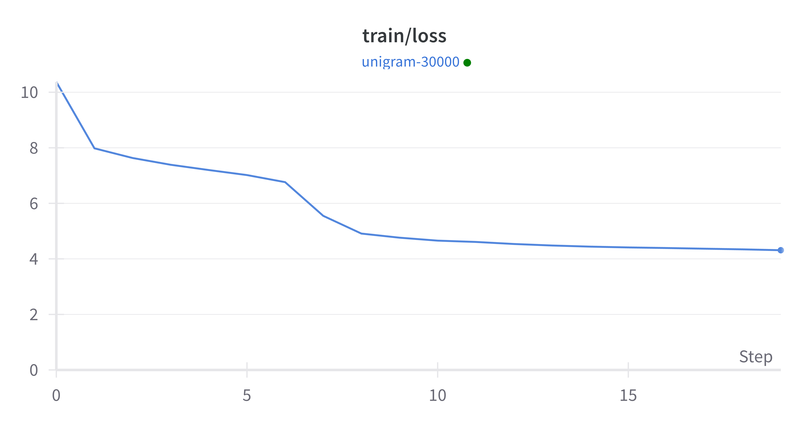

# 计算语言学大作业-实验报告

> 庾源清 2023310756 王哲凡 20233107xx

## 0. 实验环境搭建

在nanoGPT代码基础上，运行命令

```
python train.py config/train_shakespeare_char.py
```

最后10个step的截图如下：


运行命令

```
python sample.py --out_dir=out-shakespeare-char
```

生成样本截图如下：


## 1. 预训练
### 1.1 字符级别模型预训练
#### 1.1.1 数据处理
仿照nanoGPT⾥shakespeare_char对于歌词语料进行预处理，对字符进行编码。其中，训练集、验证集和测试集的划分采用原始数据中的划分方式，在全部数据上建立词表，对于训练集、验证集和测试集进行编码。数据的基本信息如下：

**词表大小**：7,409
|          | token数 |
| -------- | ------- |
| 训练集   |    34,637,186     |
| 验证集   |    864,927     |
| 测试集   |    1,731,006     |
| 全部数据 |    37,233,119     |


#### 1.1.2 模型训练
仿照nanoGPT⾥shakespeare_char，设置训练参数config/train_lyrics_char.py (选择最小规模的参数构建babyGPT)

运行命令

```
python train.py config/train_lyrics_char.py
```

训练5000轮后，train/loss=2.6334，val/loss=2.6664

Train Loss曲线和Validation Loss曲线如下:


编写代码测试测试集上的[PPL](https://huggingface.co/docs/transformers/perplexity)，设置stride=64,运行命令

```
python evaluate.py config/eval_lyrics_char.py
```

得到结果

```
PPL = 8.036737442016602
```

#### 1.1.3 歌词续写

设置tempreture=0.8，以“如果离别是为了能再见一面”为第一句续写歌词，结果如下:
```
如果离别是为了能再见一面
我也不会再思念
就算在每一天
我也都会想起你一直陪着你
我不会再怀念
就算在每一天
我也都会想起你一直陪着你
我不会再怀念
...
就算在每一天
我也都会想起你一直陪着你
我不会再怀念
就算在每一天
我也都会想起你一直陪
```
有如下观察：
1. 模型具有一定的续写能力。观察前几句的生成，逻辑上和句法上没太大问题，句尾还有“押韵”现象。
2. 模型在生成长文本时出现问题。观察后续歌词的生成，发现出现几句歌词一直循环的现象。这个现象在多次实验中均有出现，推测原因在于训练语料不够多，训练不够充分，且模型对于前面的生成的token依赖性太强。


### 1.2 分词后语⾔模型预训练

#### 1.2.1 数据处理
使用词表大小为30000的BPE算法进行分词。其中，训练集、验证集和测试集的划分采用原始数据中的划分方式，在全部数据上建立词表，对于训练集、验证集和测试集进行编码。数据的基本信息如下：

**词表大小**：30000
|          | token数 |
| -------- | ------- |
| 训练集   |    18,488,903     |
| 验证集   |    439,310     |
| 测试集   |    877,700     |
| 全部数据 |    19,805,913     |


#### 1.2.2 模型训练
设置训练参数config/train_lyrics.py

运行命令

```
python train.py config/train_lyrics.py
```

训练5000轮后，train/loss=4.30251，val/loss=4.67227

Train Loss曲线和Validation Loss曲线如下:




编写代码测试测试集上的[PPL](https://huggingface.co/docs/transformers/perplexity)，设置stride=64,运行命令

```
python evaluate.py config/eval_lyrics.py
```

得到结果

```
PPL = 58.53092575073242
```


#### 1.2.3 歌词续写

设置tempreture=0.8，以“如果离别是为了能再见一面”为第一句续写歌词，结果如下:
```
如果离别是为了能再见一面
今生的爱情故事为何错过
回忆从心会碎
曾经那么的甜蜜
在回忆中永远没开始
那是一种美丽的承诺
还是无法改变的幸福
...
在回忆中永远没开始
那些年
一个背影
在记忆中
再起 再起
在记忆中
让每个清晨
都写在彼此的记忆
都曾偶尔相遇
从时间开始
那是一种美丽的承诺
...
```

有如下观察：
1. 模型具有一定的续写能力，逻辑上和句法上没太大问题。
2. 模型在生成长文本时表现比字符级别模型更好。虽然也出现了一定程度上的歌词重复，但中间存在一些歌词跳出原有的重复循环，重复率比字符级别模型低很多。


#### 1.2.4 初始loss与词表大小关系

与字符级别模型相比，分词后语言模型的初始loss更高。

原因解释：假设词表大小为 $V$，在第一个step中模型通常会给予词表中每个单词近似相等的预测概率 $\frac{1}{V}$。在交叉熵损失函数中，对于单个实例:
$$loss(i) = -\sum_{i=1}^Vy_ilog(p_i) = -log(\frac{1}{V})=log(V)$$

在全部序列上，整体平均loss也是 $log(V)$

对于字符级别模型，词表大小为7409，初始loss约为 $log(V)\approx8.91$

对于分词后模型，词表大小为30000，初始loss约为 $log(V)\approx10.31$

估算结果与实验log一致。


### 1.3 调参

保持模型架构不变(babyGPT)，首先考虑调整 block_size和batch_size 这两个参数。考虑到显存限制，block_size 取  $[128,256,512]$，batch_size 取 $[32,64,128]$，主要参数组合及对应效果如下所示：

| Block_size | Batch_size | Train/loss | Val/loss  | PPL       |
| ---------- | ---------- | ---------- | --------- | --------- |
| 128        | 64         | 5.143      | 5.473     | 97.54     |
| 128        | 128        | 4.715      | 5.128     | 70.67     |
| 256        | 64         | 4.303      | 4.672     | 58.53     |
| 256        | 128        | 3.957      | 4.421     | **46.92** |
| 512        | 32         | 4.143      | 4.477     | 66.11     |
| 512        | 64         | **3.736**  | **4.145** | 47.57     |


有如下观察：

1. 在当前显存限制下，block_size和batch_size越大，loss越低，PPL在block_size=256，batch_size=128时达到最优。具体而言，在block_size不变时，batch_size越大，loss和PPL越低；block_size不变时，batch_size越大，loss越低和PPL越低。且block_size对结果的影响更大。
2. 存在轻微的过拟合现象。例如对于(512,64)的参数选择，loss最低，但测试集上PPL不是最优。


此外，我们还对于不同的drop_out和learning_rate进行了适当测试，固定block_size=512，batch_size=64，结果如下表所示：

| Drop_out | Learning_rate | Train/loss | Val/loss | PPL       |
| -------- | ------------- | ---------- | -------- | --------- |
| 0.3      | 1e-3          | 3.991      | 4.351    | 58.71     |
| 0.2      | 1e-3          | 3.736      | 4.145    | 47.57     |
| 0.1      | 1e-3          | **3.589**  | **4.051**| **43.53** |
| 0.1      | 1e-2          | 8.300      | 8.628    | 5005.71   |
| 0.1      | 1e-4          | 5.201      | 5.516    | 205.30    |


有如下观察：

1. 由训练loss曲线可以看到，learning_rate过小(1e-4)会导致收敛很慢，而learning_rate过大(1e-2)导致没有收敛。
2. 模型在drop_out=0.1时取得最好效果。

